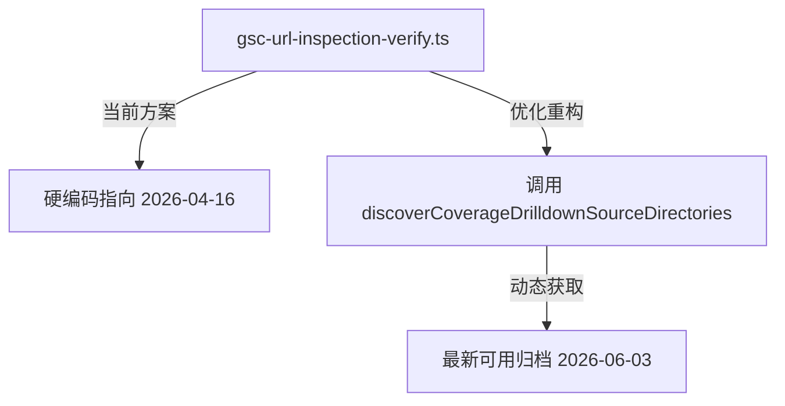

# Phase 130 调研报告：工作区及自动提交器体积优化

## 1. 背景与目标
在项目演进过程中，本地工作区积累了大量 Puppeteer 页面截图、历史流水线日志、GSC（Google Search Console）历史归档以及各类未追踪的临时文件，导致工作区总体积过大。
本阶段（Phase 130）的核心目标是**审计并安全清理这些冗余的缓存与临时文件**，从而减小项目工作区体积，同时确保不会破坏应用的编译、运行 and 现有的 158 项集成测试。

## 2. 空间审计清单 (Audit Findings)

通过对工作区的深入审计，确定了以下 6 个清理候选目标：

| 目标目录/文件 | 当前路径 | 占用体积 | 描述 & 忽略状态 | 清理策略 |
|---|---|---|---|---|
| **1. 自动提交器截图** | `scripts/auto-submitter/logs/screenshots/` | **~1.7 GB** | 遗留的 Puppeteer 页面截图。整个 `scripts/auto-submitter/logs/` 均已被 `.gitignore` 忽略。 | **彻底删除** 整个 `screenshots/` 目录。 |
| **2. 自动提交器日志** | `scripts/auto-submitter/logs/*.log` | **< 1 MB** | 包括 `aeotools.log`，大量 `dyn_*.log` 及 `report_*.json`。均已被 `.gitignore` 忽略。 | **彻底删除**。 |
| **3. 根目录临时文件** | `/Users/kaka/Dev/Killer-Skills/` 根目录下的各类未追踪临时文件 | **~150 KB** | 包括 `ph_*.png`、`*domains.txt`、`probe_*.txt`、`get_remaining.js/ts`、`valid_new_sites.json` 等。均已被 `.gitignore` 忽略。 | **彻底删除** 这些被忽略的临时文件，包括旧规划残留的根目录 `findings.md`、`progress.md` 和 `task_plan.md`。 |
| **4. 历史流水线日志** | `logs/` 目录下的 `pipeline-*.log`、`discovery.log`、`pm2-*.log` | **~92 MB** | 历史残留的 pipeline 日志文件。整个 `logs/` 目录已被 `.gitignore` 忽略。 | **彻底删除** 所有的历史 log 文件。 |
| **5. 临时错误/AI使用计数** | `.tmp/` 目录下的 `scripts_errors*.txt` 和 `workers-ai-usage.json` | **~80 KB** | 脚本错误详情和 AI 运行期计数器。已被 `.gitignore` 忽略。 | **彻底删除**。 |
| **6. GSC 历史覆盖率归档** | `data/coverage-drilldown-raw/` 下的旧目录 | **~316 KB** | 包含 2026-04-03、2026-04-16 和 2026-06-03 三个版本的归档。 | **保留最新版**（2026-06-03），**安全删除** 2026-04-03 和 2026-04-16 这两个旧目录。 |
| **7. 草稿缓存** | `data/drafts/dev-to-ide-comparison.md` | **~8 KB** | 遗留的草稿对比文件。 | **彻底删除**。 |

> [!IMPORTANT]
> **绝对不能清理的数据文件**：
> `data/` 目录下的 `authority-surfaces.json`、`docs-cache.json`、`seo-collection-canonical-map.json` / `seo-collection-locale-gaps.json` / `seo-skill-locale-governance.json` 等 JSON 文件，以及 `public/` 目录，均受到类型守卫及 [public-ai-output-guard.ts](file:///Users/kaka/Dev/Killer-Skills/scripts/public-ai-output-guard.ts) 的严密保护。这些文件为应用的运行和验证所必需，必须予以保留。

---

## 3. 风险评估与关键缓释方案

### 风险点：旧 GSC 覆盖率归档目录被脚本硬编码引用
经代码审计，发现在脚本 [gsc-url-inspection-verify.ts](file:///Users/kaka/Dev/Killer-Skills/scripts/gsc-url-inspection-verify.ts#L238) 的第 238 行存在如下硬编码：
```typescript
const archiveDir = resolve(process.cwd(), 'data/coverage-drilldown-raw/killer-skills.com-Coverage-Drilldown-2026-04-16');
```
如果在优化过程中删除了 `killer-skills.com-Coverage-Drilldown-2026-04-16` 目录，一旦运行该脚本，将会因为找不到 `table.csv` & 崩溃。

### 缓释方案
在删除旧覆盖率归档目录前，**必须先重构** [gsc-url-inspection-verify.ts](file:///Users/kaka/Dev/Killer-Skills/scripts/gsc-url-inspection-verify.ts)，将其改为通过 `scripts/lib/coverage-drilldown-source.ts` 中的 `discoverCoverageDrilldownSourceDirectories` 函数来动态获取最新日期的归档目录，从而一劳永逸地解决硬编码问题。

具体重构方案示意图与 Diff 如下：



**预期的脚本修改 (Diff 示意)**：
```diff
+import { discoverCoverageDrilldownSourceDirectories } from './lib/coverage-drilldown-source';
// ...
 async function main() {
   const config = getConfig();
-  const archiveDir = resolve(process.cwd(), 'data/coverage-drilldown-raw/killer-skills.com-Coverage-Drilldown-2026-04-16');
+  const sources = discoverCoverageDrilldownSourceDirectories();
+  if (sources.length === 0) {
+    console.error('No coverage drilldown directories found');
+    process.exit(1);
+  }
+  const archiveDir = sources[0].directoryPath; // 获取排在最前的最新目录
   const reportDir = resolve(process.cwd(), 'reports/seo');
```

---

## 4. 清理步骤与操作命令

在 Phase 130 实施中，将按照以下步骤执行清理：

1. **第一步：重构依赖脚本**
   修改 `scripts/gsc-url-inspection-verify.ts`，移除硬编码路径。
2. **第二步：清理自动提交器日志和截图**
   ```bash
   rm -rf scripts/auto-submitter/logs/screenshots/
   rm -f scripts/auto-submitter/logs/*.log
   rm -f scripts/auto-submitter/logs/*.json
   ```
3. **第三步：清理历史流水线日志**
   ```bash
   rm -f logs/pipeline-*.log
   rm -f logs/discovery.log
   ```
4. **第四步：清理 `.tmp` 目录**
   ```bash
   rm -f .tmp/scripts_errors*.txt
   rm -f .tmp/workers-ai-usage.json
   ```
5. **第五步：清理旧 GSC 覆盖率归档**
   ```bash
   rm -rf data/coverage-drilldown-raw/killer-skills.com-Coverage-Drilldown-2026-04-03/
   rm -rf data/coverage-drilldown-raw/killer-skills.com-Coverage-Drilldown-2026-04-16/
   ```
6. **第六步：清理草稿和根目录未追踪文件**
   ```bash
   rm -rf data/drafts/
   # 清理根目录下被忽略的临时辅助文件
   rm -f all_enabled_t1.txt clean_candidates.txt discovered_domains.txt enabled_t1.txt get_github_lists.sh get_remaining.js get_remaining.ts known_domains.txt new_candidates.txt probe_list.txt probe_list_final.txt probe_test.txt raw_discovery.md submitted_basenames.txt submitted_hosts.txt valid_new_sites.json
   rm -f ph_step2_error.png ph_step2_filled.png ph_step3_images_uploaded.png
   # 清理根目录下可能遗留的旧规划缓存
   rm -f findings.md progress.md task_plan.md
   ```

---

## 5. 验证计划 (Verification Plan)

实施完毕后，必须运行以下验证，以确保清理成功且无 Regression：

1. **体积缩减验证**：
   运行 `du -sh` 指令，验证 `scripts/auto-submitter/logs/` 目录大小由 1.7G 降至 0。
   验证 `logs/` 目录大小由 92M 降至近 0（仅保留 PM2 所需의占位或最小状态）。
2. **测试套件运行**：
   运行 Vitest 测试套件，确保所有的 158 项集成测试通过，没有因为误删文件引起测试失败：
   ```bash
   npm test
   ```
3. **TypeScript 编译校验**：
   ```bash
   npm run typecheck
   ```
4. **Astro 编译校验**：
   ```bash
   npm run build
   ```
5. **工作区 Git 状态检查**：
   运行 `git status` 确保受版本控制的代码库没有出现未预期的修改或删除；仅有 `gsc-url-inspection-verify.ts` 改动。
